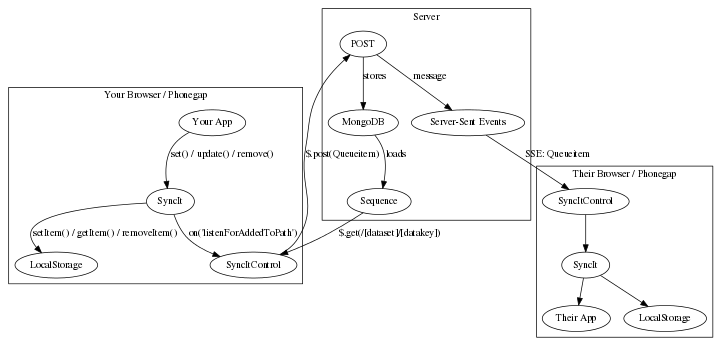

# SyncItTodoMvc

## What is it?

An attempt to adapt [TodoMVC](http://todomvc.com/) into a showcase for [SyncIt](https://github.com/forbesmyester/SyncIt).

## Architecture

## Other Components

Aside from SyncIt and TodoMVC code it also makes use of:

 * Facebook's excellent [React Framework](http://facebook.github.io/react/).
 * [Node.JS](http://nodejs.org/) and [Express](http://expressjs.com/) takes care of serving HTTP.
 * My prefered template library [Jade](http://jade-lang.com/).
 * [director](https://github.com/flatiron/director) for routing.
 * [Browserify](http://browserify.org/) For JS loading / concatenation etc.
 * [JSHint](http://www.jshint.com/)
 * [Mocha](http://visionmedia.github.io/mocha/) For testing.
 * [When](https://github.com/cujojs/when) An excellent promise library.

## Other stuff I may have used...

If this was a from-scratch project or I need to do a decent amount of work in areas which I have not yet done so on this project, I would use:

 * [Stylus](http://learnboost.github.io/stylus/)
 * [require-jsx](https://github.com/seiffert/require-jsx) does a great job of processing JSX for RequireJS, however in the end I went Browserify.

